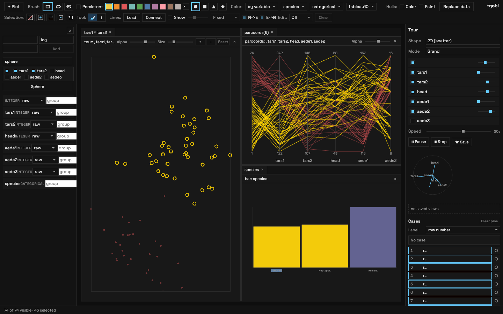
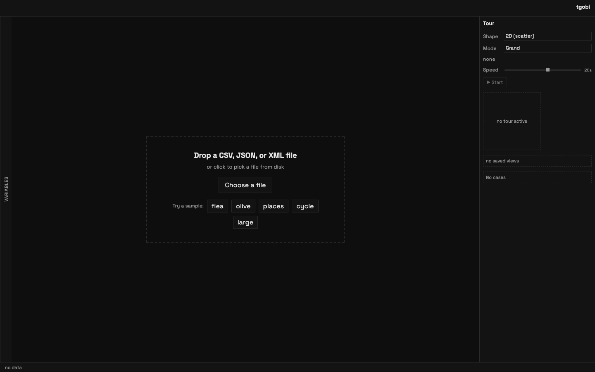
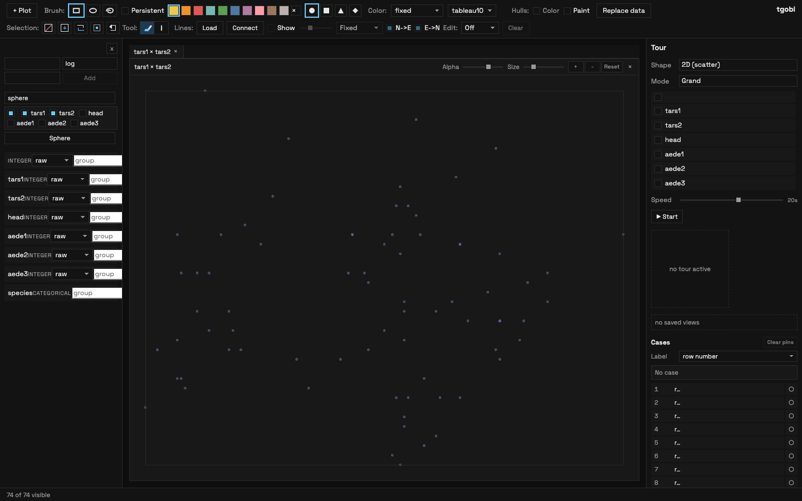
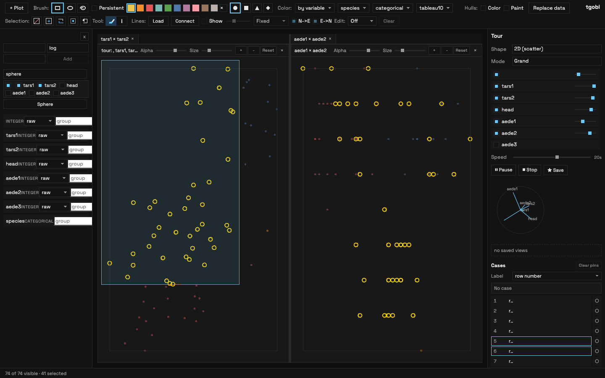

# tgobi

Interactive high-dimensional data visualization in the browser, inspired by
[GGobi](https://ggobi.org/). Explore data through linked plots, animated tours,
clustering, classification, and dimensionality reduction --- all without leaving
your browser.



## Install

```bash
npm install -g tgobi
```

Use a local install when tgobi is part of a project:

```bash
npm install tgobi
npm exec tgobi
```

`npm install tgobi` puts the executable at `node_modules/.bin/tgobi` for that
project. It does not make `tgobi` available as a bare shell command unless that
directory is on your `PATH`. These are equivalent ways to run a local install:

```bash
npm exec tgobi
npx tgobi
./node_modules/.bin/tgobi
```

Use a global install when you want `tgobi` available directly from your shell:

```bash
npm install -g tgobi
tgobi
```

## Command Line

The CLI serves the built standalone app and opens it in your browser:

```bash
tgobi
tgobi --port 8787
tgobi --host 0.0.0.0 --no-open
```

From this repository, build first and run the source checkout directly:

```bash
npm run build
node bin/tgobi.js --no-open
```

## Screenshots

Load data from disk or start with a bundled sample:



Open the variables panel and add linked plots:



Brush in one plot to highlight the same rows in every linked view, color by a
categorical variable, and run a grand tour from the tour panel:



Combine multiple plot types like parallel coordinates and barcharts to explore
complex relationships across dimensions. Selections are instantly linked across
all views, allowing you to highlight subsets in a categorical barchart and
immediately observe their structural distribution in a 2D grand tour or
high-dimensional parallel coordinates projection:


## Working With Data

tgobi accepts CSV, TSV, JSON, and GGobi-style XML files from the start screen.
After loading a file, the schema preview lets you confirm inferred column types
before committing the dataset.

The bundled samples are useful for quick checks:

- **flea**: small categorical dataset for brushing, color, and tour examples.
- **olive**: regional olive oil measurements.
- **places**: mixed geographic and numeric data.
- **cycle**: XML sample for GGobi import coverage.
- **large**: synthetic large dataset for performance testing.
- **missing**: dataset with missing values for imputation demos.
- **synthetic-large**: synthetic data for scagnostics and clustering demos.

## Using The App

### Plots

Add plots with **+ Plot**. Supported plot types:

| Type | Description |
|------|-------------|
| Scatterplot | Two numeric variables, x-y |
| 3D scatterplot | Three numeric variables, x-y-z with camera rotation (available but parked from default UI) |
| Scatterplot matrix | 2-8 numeric variables, all pairwise scatterplots |
| Parallel coordinates | 2+ numeric variables, linked axes; optionally conditioned by a categorical variable |
| Barchart | Single variable (categorical or numeric), frequency counts |
| Dotplot | Single numeric variable, 1D strip |
| Boxplot | Single numeric variable with optional grouping; shows median, quartiles, whiskers, outliers |
| Time series | Numeric x-axis, one or more y variables with optional grouping |
| Andrews curves | Multivariate Fourier curves, one per observation |
| Concentric coordinates | Radial axis layout, one ring per variable |
| Missing pattern | Overview of missingness across all variables |
| Mapper graph | TDA Mapper network, nodes = clustered intervals, edges = shared rows |

Multiple plots are linked: selecting, painting, or hovering in one plot
highlights the same rows in every other plot.

### Brushing and Painting

Use the brush toolbar to select rows:

- **Transient**: selection disappears when you release the mouse.
- **Persistent**: each brush stroke paints a group with a distinct color
  (brushed groups 1-8).

Brush shapes: rectangle, ellipse, or lasso.

The selection toolbar offers:

| Button | Action |
|--------|--------|
| Exclude | Hide selected rows (shadow/ghost them) |
| Include | Restore selected shadowed rows |
| Invert | Flip which rows are shadowed |
| Isolate | Hide everything *except* the selected rows |
| Restore | Bring all rows back (clear shadow mask) |

### Filtering and Excluding Rows

Shadowed (excluded) rows are dimmed in every plot and **excluded from all
computations** --- tour, clustering, classification, and projection skip them.
The status bar shows "N of M visible" where N counts only non-shadowed rows.

**Common workflow --- exclude a category** (e.g. remove one region from the
olive oil dataset):

1. Add a **Barchart** of the categorical variable (e.g. `region`).
2. Click the bar for the category you want to remove. This selects all rows
   in that category (linked across every plot).
3. Click **Exclude** in the selection toolbar. The rows are now shadowed.
4. Repeat for any other categories you want to exclude.
5. To bring rows back: select them and click **Include**, or click
   **Restore** to un-shadow everything.

**Alternative --- keep only a subset**:

1. Select the rows you want to *keep* (brush in a scatterplot, click bars in a
   barchart, or drag a range in a boxplot).
2. Click **Isolate** ("Exclude all but selected"). Everything else is shadowed.

**Exclude by boxplot range**:

1. Add a **Boxplot** of the numeric variable.
2. Click the box body to select all rows in that group, or drag vertically on
   the boxplot to select a value range.
3. Click **Exclude** to shadow the selected rows.

### Coloring

The color toolbar controls how points are colored:

- **Fixed**: all points in one color.
- **Brushed groups**: color by painted group (persistent brushing).
- **By variable**: color by a data column. Categorical variables pair well with
  `tableau10`; numeric variables support sequential or diverging scales.

### Identify Tool

Switch to the **Identify** tool to hover over points and see their row label.
Click to pin a label; click again to unpin. Set the label variable in the
identify toolbar.

### Keyboard Shortcuts

Press **?** in the app to see the shortcut reference.

| Key | Action |
|-----|--------|
| B | Switch to brush tool |
| I | Switch to identify tool |
| T | Toggle transient / persistent brush mode |
| E | Exclude selected rows |
| R | Restore all excluded rows |
| Space | Play / pause tour |
| Esc | Clear selection or stop tour |

Shortcuts are ignored when focus is in an input, select, or textarea, or when
meta/ctrl/alt is held.

### Data Export

Click **Export CSV** in the toolbar to download the current dataset as a CSV
file. The export respects the current view:

- **Visible only**: by default, excluded (shadowed) rows are omitted.
- **Brushed groups**: appends a `_paint_group` column when rows have been painted.
- **Cluster labels**: appends a `_cluster` column when clustering has been
  applied.

### Edges

Load an edges layer (e.g. a graph or path) alongside your data. Edge visibility,
alpha, and color mode are configurable. You can also draw sequential edges that
connect rows in dataset order.

### Hulls

Toggle convex hulls per brushed group or color group to visually enclose clusters
in scatterplots.

### Variable Transforms

Right-click a variable in the left sidebar to derive a transformed column:

| Transform | Description |
|-----------|-------------|
| log | Natural logarithm |
| sqrt | Square root |
| rank | Rank transform (average ties) |
| negate | Multiply by -1 |
| power | Custom exponent |
| jitter | Add small random noise |
| standardize | z-score (mean 0, sd 1) |
| miss_ind | Binary indicator for missingness |
| impute_fixed | Replace missing with a constant |
| impute_rand | Replace missing with a random observed value |
| impute_cond | Replace missing conditional on a categorical variable |

**Scaling**: each variable can also be scaled independently (raw, 0-1 range,
z-score, or robust/IQR-based) without creating a new column.

**Sphering**: the "Sphere" button derives spherical coordinate columns
(theta, phi, r) from selected Cartesian x/y/z variables.

### Missing Data

The **Missing pattern** plot shows a heatmap of missingness across all variables
and rows (black = present, colored = missing). The missing-data panel controls
imputation method, fixed value, seed, and conditioning variable. Multiple
imputation sets can be cycled through to visualize imputation uncertainty.

---

## Right Sidebar Tabs

The right sidebar has six tabs: **Tour**, **Project**, **Cluster**,
**Classify**, **Scag** (scagnostics), and **Mapper** (topological data
analysis).

### Tour Tab

Animate projections through high-dimensional space. Requires a scatterplot (2D
tour) or dotplot (1D tour) to be open.

**Shape**:
- **2D (scatter)**: rotates a 2D projection plane through p-dimensional space.
- **1D (dotplot)**: rotates a 1D projection direction.
- **Correlation (2x1D)**: two *independent* 1D projections of two disjoint
  variable sets --- one drives the X axis of a scatterplot, the other drives
  Y. Useful when you want to ask "does a 1D projection of one block of
  variables correlate with a 1D projection of another?" The variable list
  is split (first half → X-set, second half → Y-set); each set rotates
  through its own grand or projection-pursuit path.

**Modes**:

| Mode | Description |
|------|-------------|
| Grand | Randomly walks through all projection planes. Good for overview. |
| Projection pursuit | Steers the tour toward projections that optimize an index. |
| Manual | Fixes all variables except one, letting you scrub that variable's contribution with a slider. |
| Guided | Define a sequence of keyframe projections, then smoothly interpolate between them using Catmull-Rom splines. A scrubber slider gives arc-length-parameterized reversible playback. |
| Langevin | Stochastic tour with configurable step size and diffusion temperature. Spends more time near interesting projections while maintaining exploration. |

**Projection pursuit goals**:

| Goal | Optimizes | When to use |
|------|-----------|-------------|
| Holes | 1 - central density | Finding projections with hollow structure (clusters on the rim) |
| Central mass | Central density | Finding projections with dense centers |
| LDA | Between-class / within-class variance | Requires 2+ brushed groups or a categorical class variable; finds projections that separate groups |
| PCA variance | Total variance in projection | Finds projections that spread data out most |
| Kurtosis | Absolute excess kurtosis | Finding heavy-tailed or multi-modal structure |

The variable circle shows each variable's current contribution as a point on a
unit circle. Frozen variables hold their direction while others rotate.

**Saved views**: click **Save** to bookmark the current projection. Click a
saved view to restore it.

**Keyframe gallery**: in guided mode, save keyframes and see thumbnail previews.
The scrubber slider interpolates along Catmull-Rom splines with arc-length
parameterization for perceptually uniform speed.

**PP score trace**: a sparkline at the bottom of the tour panel shows the
projection pursuit index value over time, so you can see when the tour finds
interesting projections.

### Project Tab

Compute a static low-dimensional embedding and add it to the dataset as new
columns.

**Methods**:

| Method | Type | Output | Loadings |
|--------|------|--------|----------|
| PCA | Linear | Orthogonal components maximizing variance | Yes (eigenvectors) |
| MDS | Distance-based | Preserves pairwise distances | Permutation importance |
| ICA | Linear | Statistically independent components | Yes (mixing matrix) |
| t-SNE | Nonlinear | Preserves local neighborhoods | Permutation importance |
| UMAP | Nonlinear | Preserves local+global structure | Permutation importance |

**Controls**:
- **Method**: choose the algorithm.
- **Dims**: number of output dimensions (2+).
- **Variables**: check which numeric columns to include.
- Method-specific parameters (perplexity/iterations for t-SNE, neighbors/min
  dist for UMAP).

**After computing**:
- **X / Y**: pick which dimensions to plot.
- **Add to data**: materializes the embedding as new columns (e.g. `PCA.1`,
  `PCA.2`) and opens a scatterplot.
- **Clear**: resets the projection.
- **Compare DR**: computes all 5 methods at once, Procrustes-aligns them to
  the PCA reference, and displays a morphing animation that interpolates
  between the embeddings so you can see structural differences.

**Component information**:

For PCA and ICA, the panel displays a **loadings table** showing how much each
original variable contributes to each component. Headers are labeled `PC1`,
`PC2`, ... (PCA) or `IC1`, `IC2`, ... (ICA). Values with |loading| > 0.5 are
highlighted. A cumulative variance row (`Cum %`) shows running explained
variance for PCA.

For MDS, t-SNE, and UMAP, a **variable importance** table ranks variables by
how much the embedding changes when that variable is permuted (permutation
importance, 3 repetitions). This identifies which variables most influence the
nonlinear structure.

**Quality metrics**: after any projection, trustworthiness and continuity
scores (Venna & Kaski 2006) and a Shepard diagram are computed automatically.
These quantify how faithfully the embedding preserves original-space
neighborhoods.

See [Methods Guide](docs/methods.md) for the mathematical details.

### Cluster Tab

Assign cluster labels to rows and paint them with distinct colors.

**Methods**:

| Method | Type | Key parameter | When to use |
|--------|------|---------------|-------------|
| K-Means | Fixed k | k | Known number of clusters, spherical clusters |
| Hierarchical | Fixed k | k, linkage | Small datasets, dendrogram-style |
| DBSCAN | Density-based | eps, minPts | Arbitrary shapes, noise detection |
| OPTICS | Density-based | eps, minPts, xi | Variable-density clusters |
| X-Means | Auto k | kMax | Unknown number of clusters (uses BIC) |

**Workflow**:
1. Check the numeric variables to cluster on.
2. Set method and parameters.
3. Click **Compute**.
4. Click **Paint** to color rows by cluster assignment.

**Linkage options** (hierarchical): complete, single, average.

X-Means iterates k = 1..kMax and picks the best k by Bayesian Information
Criterion. OPTICS extracts clusters using the xi steepness parameter.

**Diagnostics**: after clustering, the panel shows silhouette scores (overall
and per-cluster), a dendrogram with draggable cut line (hierarchical), a
reachability plot (OPTICS), and a k-distance plot (DBSCAN/OPTICS) to help
select eps.

### Classify Tab

Build a classifier from brushed groups or a categorical variable and visualize
the decision boundary in any plot --- including animated tours. Inspired by R's
[classifly](https://cran.r-project.org/package=classifly) package: instead of
shading regions, tgobi samples the predictor space on a grid, asks the trained
model what it would predict at each grid point, and keeps only those grid points
where the prediction *changes between neighbors* (the neighbor-disagreement
rule). Those boundary points are rendered as outline rings, colored by their
predicted class.

**Methods**:

| Method | Key parameter | Description |
|--------|---------------|-------------|
| KNN | k | k-nearest neighbors with calibrated neighbor-fraction probabilities |
| Naive Bayes | - | Gaussian naive Bayes with softmax posterior |
| Logistic | lambda, iter | Multinomial logistic regression, L2 regularized |
| Random Forest | trees, max depth | Bagged decision trees with per-class vote ratio |

All four methods return calibrated per-class probabilities that drive the
**Uncertainty** filter.

**Class source**: choose **Brushed groups** to train on persistent-brush paint
colors, or pick a **categorical variable** from the data as class labels.

**Workflow**:
1. **Brush** 2+ groups of points (persistent mode) --- these become the
  training labels. Alternatively, set **Class** to a categorical variable
  in the data.
2. **Check** the numeric variables you want the model to use.
3. **Boundary** mode: choose either *2D slice* (grid varies only along the
  first 2 selected variables, others held at their training-set medians) or
  *Full space* (grid varies along every predictor). Full-space grids stay
  tour-meaningful in any projection but the point count grows as
  `resolution^p`; tgobi caps the total at 200 000 and shows the effective
  resolution next to the input.
4. Pick the **Grid** resolution. The label next to it shows the projected
  point count, e.g. `5x5 = 25 pts` or `7^6 = 117 649 pts (capped from 15)`.
5. Click **Train**, then **Show** to draw the boundary rings.

**Uncertainty filter** (slider): each boundary point also carries the
classifier's `1 - max(class probability)` at that location. Drag the slider
to hide confident points and keep only the uncertain ones. A live
*N of M shown* counter ticks down as you raise the threshold.

**Misclassified** training points render as an X-cross over their brushed
glyph, so you can see at a glance which examples the model disagrees with.

**Where boundaries appear**: boundary rings are an overlay layer, not synthetic
data rows. They draw in scatter and scatterplot-matrix plots whose axes are
predictors, and in a running 2D tour over the same (or a superset of the)
predictor variables. They do **not** appear in the missing-pattern view,
parallel coordinates, boxplots, or CSV export --- those views see the original
data unchanged.

In a tour, the boundary grid is standardized the same way the tour worker
standardizes the data and then multiplied by the active basis, so the rings
stay aligned with the rotating clusters. Tour-active variables that aren't
predictors contribute nothing to the projection (their standardized value
is 0).

**Train/test split** (optional): when enabled, the labeled data is split
stratified by class. The diagnostics panel reports test-set accuracy and a
5-fold cross-validation estimate alongside the training-set confusion matrix.

### Scag Tab (Scagnostics)

Compute nine scatterplot diagnostic measures over all variable pairs:

Outlying, Skew, Clumpy, Sparse, Striated, Convex, Skinny, Stringy, Monotonic.

**Controls**:
- Select variables to include.
- **Sort** results by any measure (ascending/descending).
- **Filter** pairs by a threshold on any measure.
- **Reorder scatmat**: when results exist, the scatterplot matrix can be
  reordered so that the highest-scoring pairs are clustered together.
- **Open top pair**: add a scatterplot of the top-ranked variable pair.
- **Seed tour**: open a scatterplot and start a 2D tour on the top-ranked pair.

Computation runs in a web worker for smooth UI.

### Mapper Tab (Topological Data Analysis)

Build a Mapper graph from the data --- a network that summarizes the shape of
high-dimensional structure through overlapping local views.

**Filter (lens) functions**:

| Lens | Description |
|------|-------------|
| Variable | Use a data variable directly |
| PCA 1 | First principal component score |
| PCA 2 | Second principal component score |
| PCA residual | Reconstruction error from 2-component PCA |
| Eccentricity | L2 distance to farthest point |
| Density | Gaussian kernel density estimate |

**Parameters**:

| Parameter | Default | Description |
|-----------|---------|-------------|
| Intervals | 10 | Number of overlapping bins along the filter |
| Overlap | 0.5 | Fractional overlap between intervals |
| Clustering | k-means | Method used within each interval (k-means, hierarchical, or DBSCAN) |
| Cluster k | 3 | Number of clusters per interval (k-means/hierarchical) |

**After computing**:
- **Mapper** plot type: a first-class plot panel with force-directed node-link
  layout, pan/zoom, and hover tooltips. Node size encodes cluster membership
  count; edge width encodes shared-row count.
- **Node selection**: clicking a node selects all data rows in that cluster,
  updating the selection mask across all linked views.
- **Node detail view**: shows connection summary and per-variable statistics
  (mean, sd, min, max) within the selected node.
- **Color by**: nodes colored by size or by the mean value of any variable.
- **Parameter sweep**: compute a grid of (intervals x overlap) combinations and
  display nodes/edges/components/modularity for each, helping you find stable
  parameter choices. Runs in a web worker.

---

## Session Save/Load

Click **Save Session** to download the entire app state (data + configuration)
as a JSON file. Click **Open Session** to restore it. The session preserves:

- Loaded data and column types
- Variable specs (include/exclude, scaling, groups)
- Selection state (paint, shape, shadow)
- Tour, clustering, classification, projection, scagnostics, and mapper
  parameters

Computed results (embeddings, cluster assignments, boundary grids, scagnostic
scores, mapper graphs) are not saved --- they must be re-run after loading a
session. Open plot panels and tour saved views/keyframes are also not
currently persisted.

## Guided Lessons

tgobi includes interactive step-by-step tutorials. Click **Lessons** to start
one:

- **Brushing & Tours with Flea Beetles**: linked brushing, color encoding,
  grand tour, and projection pursuit.
- **LDA & Classification with Olive Oils**: painting groups, LDA tour,
  classification, and decision boundaries.
- **Missing Data & Imputation Uncertainty**: missing pattern plots, imputation
  methods, and cycling through multiple imputations.
- **Scagnostics & Clustering on Synthetic Data**: scagnostic measures,
  scatterplot matrix reordering, and clustering.

Each lesson loads the appropriate sample dataset automatically.

---

## Methods Guide

See [docs/methods.md](docs/methods.md) for the mathematical foundations of each
algorithm, key equations, and implementation notes.

## Post-GGobi Roadmap

See [docs/post-ggobi-roadmap.md](docs/post-ggobi-roadmap.md) for a survey of
advances since the GGobi era and their implementation status in tgobi.

## Embed In React

```tsx
import { Tgobi } from "tgobi";
import "tgobi/styles.css";

export function MyPage() {
return (
<div style={{ height: "100vh" }}>
    <Tgobi />
</div>
);
}
```

You can pass a `DataFrame`-compatible object as `data`:

```tsx
<Tgobi data={myDataFrame} />
```
